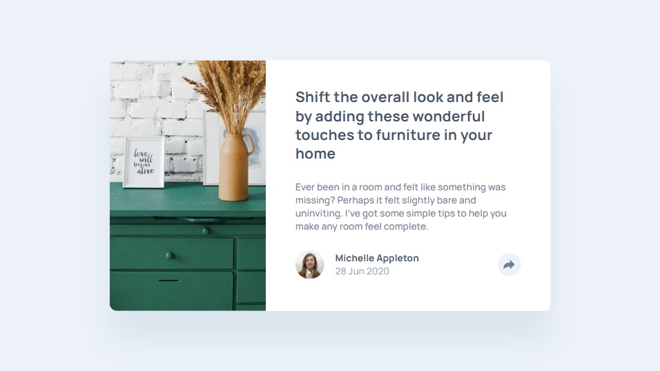

# Frontend Mentor - Article Preview Component

This is my solution to the [Article Preview Component challenge on Frontend Mentor](https://www.frontendmentor.io). This challenge focuses on component-level design and interactive behavior using JavaScript.

## 🚀 Live Site

- **Live URL**: [Add your live site link here](https://mohammed-osama-pg.github.io/FdMr-Article-preview-component/)
- **GitHub Repo**: [Add your GitHub repo link here](https://github.com/Mohammed-Osama-pg/FdMr-Article-preview-component.git)

## 📑 Table of Contents

- [Pre-Project Notes](#-pre-project-notes)
  - [What's the challenge?](#-whats-the-challenge)
  - [Requirements](#-requirements)
  - [Ideas to test myself](#-ideas-to-test-myself)
  - [Resources](#-resources)
  - [Time Taken](#-time-taken)
- [Built With](#️-built-with)
- [Screenshot](#-screenshot)
- [What I Learned](#-what-i-learned)
- [Useful Resources](#-useful-resources)
- [Author](#-author)

---

## 📝 Pre-Project Notes

### ❓ What's the challenge?

My challenge is to build the Article Preview Component as close to the design as possible, and use JavaScript to initiate the share options when someone clicks the share icon.

### 📋 Requirements

**Users should be able to:**

- View the optimal layout for the component depending on their device's screen size.
- See the social media share links when they click the share icon.

### 💡 Ideas to test myself

- Write the styles using a CSS pre-processor like Sass
- Train my eye for detail by getting the solution as close to the design as I can
- Estimate the time to build the project and compare with the actual time spent

### 🔍 Resources

- for test the HTML code: [Nu Html Checker](https://validator.w3.org/nu/#textarea)

### ⏱️ Time Taken

- **Estimated time**: 5 hours (including notes and research)
- **Actual time**:
  - Reviewing and note-taking: 30 minutes
  - Building the project: 3 hours and 9 minutes (189 minutes)
  - Final review and checks: 30 minutes

---

## 🛠️ Built With

- HTML5
- Sass (CSS Pre-processor)
- JavaScript (for share icon interaction)
- Mobile-first design

## 📸 Screenshot

## 💡 What I Learned

This project helped me practice combining layout, styling, and interactivity. I got more comfortable with using JavaScript to handle UI behavior, such as toggling visibility for share options. I also refined my approach to estimating time and managing workflow in small components.

## 📚 Useful Resources

- [JavaScript Event Handling (MDN)](https://developer.mozilla.org/en-US/docs/Web/Events)

## 👤 Author

- GitHub – [Mohammed-Osama](https://github.com/Mohammed-Osama-pg)
- Frontend Mentor – [@Mohammed-Osama](https://www.frontendmentor.io/profile/Mohammed-Osama-pg)
- LinkedIn – [@Mohammed-Osama](https://www.linkedin.com/in/mohammed-osama-a4124228b)
